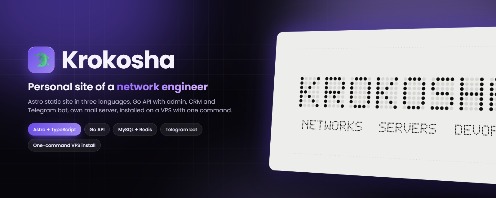
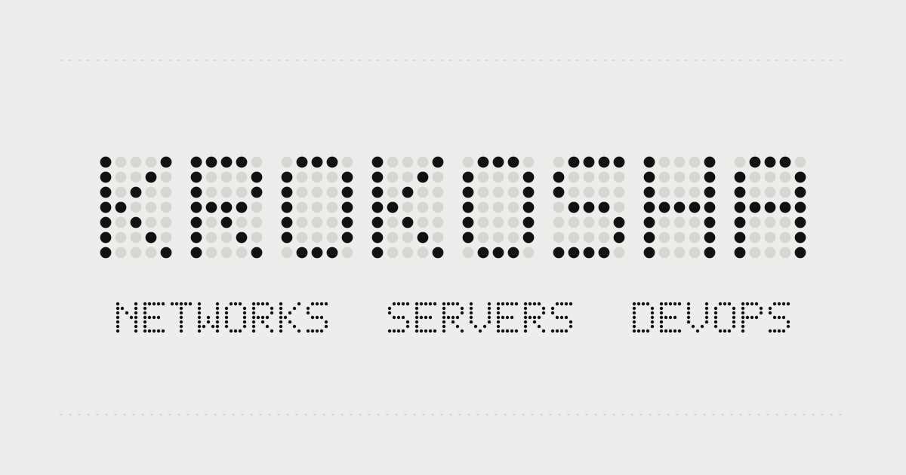
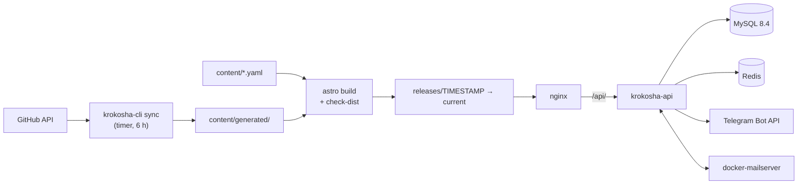

<div align="center">



# krokosha-site

**Source of [krokosha.com](https://krokosha.com): the personal site of Krokosha, a network & infrastructure engineer. A static Astro site, a self-hosted Go API with admin area, lead CRM and Telegram bot, and a one-command VPS installer.**

[](https://github.com/DenisHumen/krokosha-site/actions/workflows/ci.yml)
[](web/package.json)
[](api/go.mod)
[](deploy/compose/compose.yaml)
[](deploy/README.md)
[-6b4de6?style=for-the-badge)](LICENSE)
[](https://github.com/DenisHumen/krokosha-site/commits/main)

**English** · [Русский](README.ru.md)

[Features](#-features) · [Quick start](#-quick-start) · [Deployment](#-usage) · [Architecture](#-tech-stack--architecture) · [Roadmap](#-roadmap)

</div>

---

This repository holds everything behind [krokosha.com](https://krokosha.com), the site of Krokosha (networks, servers, DevOps, tooling). Pages are built by Astro into static HTML from editable YAML and from GitHub data pulled by a Go sync job. A single Go service provides first-party analytics, an admin area, the contact-form CRM, a Telegram bot, a client account and an interactive map of the internet. One script installs the whole stack on a clean Ubuntu server, and CI tests that install end to end.

> **Status:** by [docs/roadmap.md](docs/roadmap.md) the backend is complete (steps 1–8), design v1 is integrated into the site, and the admin area and client account use design v3. Most project documents are in Russian.

<div align="center">
  
</div>

## ✨ Features

**Site**

| | |
|---|---|
| 🌐 **Three languages, full SEO** | English (`/`), Ukrainian (`/uk/`), Russian (`/ru/`), with hreflang, canonical URLs, Open Graph, JSON-LD, `sitemap.xml` and `robots.txt`. Lighthouse thresholds of 0.95 are enforced in CI. |
| 🔒 **Strict CSP, no JS required** | Astro hashes every script and style into a `<meta>` CSP; the page reads and works without JavaScript, including the contact form. |
| 🗂 **Content as data** | Texts live in `content/*.yaml` and are validated by a strict schema, so a typo stops the build instead of breaking the site. Experience years are computed at build time. |
| 🐙 **GitHub projects** | `krokosha-cli sync` ranks public repositories into tiers, caches with ETag and keeps working without a token or when GitHub is down. |
| 🗺 **Map of the internet** (`/map`) | Autonomous systems and their links from open data, in three views (map, core, globe); draws the likely route between two addresses and can trace the path from the site's server. |
| 🥚 **Easter eggs & achievements** | Hidden eggs with Steam-style achievement rarity and sounds, plus a game on the 404 page. |
| 👤 **Client account** (`/account`) | Passwordless sign-in with a one-time code by email or from the Telegram bot: requests and conversations, discounts and levels, achievements, contacts and devices. |

**Backend (`krokosha-api`)**

| | |
|---|---|
| 📊 **Private analytics** | Cookie-less, first-party script (< 3 KB gzip). Visitors are a daily-salted hash, IPs are stored truncated, DNT/GPC are honoured and bots are filtered. Daily roll-ups and offline GeoIP (DB-IP City Lite or GeoLite2). |
| 🧑‍💼 **Admin area** | Secret path, argon2id passwords, TOTP 2FA, CSRF protection, session list and audit log. Overview with live feed (SSE), visits, CSV export, server traffic from the nginx JSON log, system status and a "rebuild now" button. |
| 📨 **Lead CRM** | No-JS form with point-based anti-spam and ALTCHA-compatible proof-of-work, transactional outbox with retries, list and kanban board, reply templates in three languages, quick replies with files, optional attachments and retention rules. |
| 🤖 **Telegram bot** | Written against the Bot API without libraries: invite-only access, lead cards with buttons, a relay to clients, `/leads` `/lead` `/search` `/stats` `/mute`, reminders and a morning digest. Webhook or long polling. |
| ✉️ **Own mail server** | docker-mailserver (Postfix, Dovecot, Rspamd) with DKIM, HMAC-signed reply addresses, and client replies read over IMAP IDLE into the right request. |

**Operations**

| | |
|---|---|
| 🚀 **One-command install** | `deploy/install.sh` sets up nginx + Let's Encrypt, MySQL/Redis/mail in Docker, pinned Go and Node.js toolchains verified by SHA-256, UFW (keeps WireGuard working), fail2ban and systemd timers. Re-running it is safe. |
| 🔁 **Releases & rollback** | Rebuilds every 6 hours into a new release directory, checks it, then switches a symlink atomically; the last three are kept for `rollback.sh`. The domain can be changed with one command. |
| 💾 **Backups & restore** | Nightly MySQL dump, settings, certificates, mail and attachments (hard-linked between copies), 7 daily + 4 weekly, optional off-site `rsync`; `restore.sh` rebuilds a lost server. |
| 🩺 **Watchdogs** | Certificate watch on what nginx and the mail server actually serve, owner alerts by email and Telegram, IndexNow for changed pages. |
| 🧪 **Tested installs** | A local "VPS in a container" runs the real installer; CI installs, updates, rolls back, restores and removes the site on a clean Ubuntu 24.04 VM. |

## 🚀 Quick start

**Prerequisites:** Node.js ≥ 22.12 (CI and the server use the version in [`web/.nvmrc`](web/.nvmrc)), Go (version in [`api/go.mod`](api/go.mod)), and Docker for integration tests, the local admin and the staging server.

### Site (`web/`)

```bash
git clone https://github.com/DenisHumen/krokosha-site.git
cd krokosha-site/web
npm ci
npm run dev       # http://localhost:4321
npm run verify    # everything CI runs: format, lint, types, tests, mock check, build, dist check
```

Without `content/generated/github.json` (a fresh clone), the build uses the repository snapshot from `mock/en/projects.json`.

<details>
<summary><b>All npm scripts</b></summary>

| Script | What it does |
|---|---|
| `npm run dev` | Astro dev server on `:4321` |
| `npm run build` · `npm run preview` | Build into `dist/` · serve the build |
| `npm run check` · `npm run lint` | `astro check` (types) · ESLint (TypeScript, Astro, accessibility) |
| `npm run format` · `npm run format:check` | Prettier |
| `npm test` | Vitest unit tests |
| `npm run test:e2e` | Playwright + axe against the built site (run `npm run build` first) |
| `npm run mock` · `npm run mock:check` | Regenerate `../mock/` after editing `content/*.yaml` · check it is current |
| `npm run verify` | All of the above that CI runs, plus `scripts/check-dist.mjs` |

</details>

### API and CLI (`api/`)

```bash
cd api
go test ./...                                         # unit tests (integration tests are skipped)
docker compose -f compose.test.yaml up -d --wait      # throw-away MySQL and Redis
KROKOSHA_TEST_MYSQL=127.0.0.1:33306 KROKOSHA_TEST_REDIS=127.0.0.1:36379 go test ./...
go run ./cmd/krokosha-cli sync -v                     # GitHub data → ../content/generated/
go build -trimpath -o bin/ ./cmd/...                  # krokosha-api and krokosha-cli
dev/run-local.sh                                      # admin area with demo data → http://localhost:8099/_dev/
```

`GITHUB_TOKEN` is optional: a fine-grained, read-only token raises the GitHub API limit from 60 to 5,000 requests per hour.

### Local staging server

A Docker container that behaves like the VPS (Ubuntu 24.04 with systemd) and runs the real installer, MySQL and Redis included:

```bash
deploy/docker/staging/staging.sh up       # install the current branch → https://krokosha.localhost
deploy/docker/staging/staging.sh update   # pull new commits and apply them
deploy/docker/staging/staging.sh test     # the full CI cycle: install, repeat, update, roll back, remove
deploy/docker/staging/staging.sh shell    # root shell inside
deploy/docker/staging/staging.sh down     # remove the stand
```

The certificate is self-signed. The staging admin area is at `https://krokosha.localhost/_staging/` (login `dev`; `staging.sh up` prints the random password). On Windows use Docker Desktop from Git Bash or WSL.

## ⚙️ Configuration

**Content** lives in [`content/`](content/README.md) and is picked up by the next build (every 6 hours, or the admin's rebuild button):

| File | Contents |
|---|---|
| `content/site.yaml` | Site URL, profile, `career_start`, social links, services, UI strings, SEO, feature flags (eggs, form, attachments) |
| `content/skills.yaml` | Skill tree: category → group → skill (`confirmed: false` items stay hidden) |
| `content/projects.yaml` | Pinned / hidden repositories, manual overrides, private (NDA) projects |
| `content/pages/*.md` | Long texts per language (privacy policy) |
| `content/avatar.*` | Optional custom avatar; otherwise the GitHub avatar is used |

The site URL comes from `content/site.yaml` and can be overridden with `SITE_URL` at build time.

**Server settings and secrets** are kept in `/etc/krokosha/env` (root, `600`), created and maintained by the installer. Every variable is described in [`deploy/env/.env.example`](deploy/env/.env.example).

<details>
<summary><b>Main server variables</b></summary>

| Variable | Default | Purpose |
|---|---|---|
| `DOMAIN`, `SITE_URL`, `ADMIN_EMAIL` | from `install.sh` | Site name, public URL, administrator address |
| `ADMIN_PATH` | random | Secret prefix of the admin area |
| `KROKOSHA_DATA` | `/srv/krokosha` | Root of everything that must survive a move |
| `MYSQL_ADDR`, `MYSQL_DATABASE`, `MYSQL_USER`, `MYSQL_PASSWORD` | `127.0.0.1:3306`, `krokosha`, `krokosha`, generated | Database |
| `REDIS_URL` | local, generated password | Optional; without it limits are kept in memory |
| `APP_SECRET` | generated | Signs proof-of-work challenges, reply addresses and links |
| `SMTP_*`, `MAIL_*`, `IMAP_*` | set with the mail server | Outgoing mail, the `leads@` service mailbox |
| `TELEGRAM_BOT_TOKEN`, `TELEGRAM_MODE` | empty, `webhook` | Bot token; `webhook` or `polling` |
| `LEADS_KEEP_MONTHS`, `LEADS_EXPIRED`, `LEADS_SPAM_DAYS` | `24`, `anonymize`, `30` | Retention of requests |
| `ANALYTICS_KEEP_MONTHS` | `12` | Raw analytics retention (daily sums stay) |
| `GEOIP_DB` | set by the installer (DB-IP City Lite) | MaxMind DB file for countries and cities; `off` disables |
| `INDEXNOW` | `yes` | Report changed pages to search engines |
| `BACKUP_KEEP_DAILY`, `BACKUP_KEEP_WEEKLY`, `BACKUP_RSYNC_TO` | `7`, `4`, empty | Backup rotation and off-site copy |
| `GITHUB_TOKEN` | empty | Optional read-only token for the sync |

</details>

## 🧭 Usage

### Install on a server

Ubuntu 24.04 (or Debian 12), with the domain already pointing at the server:

```bash
git clone https://github.com/DenisHumen/krokosha-site.git
sudo ./krokosha-site/deploy/install.sh --domain example.com --email admin@example.com
```

The installer asks you to accept the Let's Encrypt terms (or pass `--agree-tos`), then for the first administrator's login and password (no echo, twice, at least 12 characters). At the end it prints the secret admin URL, so keep it. Running it again brings the server back to the same state; all options are listed by `install.sh --help`.

| What | Where |
|---|---|
| Code and binaries | `/opt/krokosha/repo`, `/opt/krokosha/bin` |
| Pinned Go / Node.js | `/opt/krokosha/toolchain` (versions and SHA-256 in [`deploy/toolchain.env`](deploy/toolchain.env)) |
| Site releases | `/var/www/krokosha/releases/<timestamp>`, `current` → live release |
| **Data** | `/srv/krokosha`: `mysql/`, `redis/`, `mail/`, `attachments/`, `backups/`, `config/` |
| Settings and secrets | `/etc/krokosha/env` → `/srv/krokosha/config` |
| API | `krokosha-api.service` on `127.0.0.1:8080`, behind nginx at `/api/` |
| Logs | `journalctl -u krokosha-sync.service` (and the other `krokosha-*` units), `/var/log/krokosha/` (JSON access logs, 30 days) |

### Day-to-day operations

```bash
sudo /opt/krokosha/repo/deploy/update.sh              # pull main and apply: code, configs, build, release
sudo systemctl start krokosha-sync.service            # rebuild now (otherwise every 6 hours)
sudo /opt/krokosha/repo/deploy/rollback.sh            # back to the previous release (--list shows all)
sudo /opt/krokosha/repo/deploy/backup.sh              # back up now (otherwise nightly at 03:30)
sudo /opt/krokosha/repo/deploy/restore.sh --from DIR  # restore from a backup
sudo /opt/krokosha/repo/deploy/uninstall.sh           # remove the site; data in /srv/krokosha stays (--purge removes it)
sudo /opt/krokosha/repo/deploy/install.sh --from-env --domain NEW-DOMAIN   # move to a new domain
```

<details>
<summary><b>Installer options</b></summary>

| Option | Description |
|---|---|
| `--domain DOMAIN` · `--email EMAIL` | Site host name · administrator address (Let's Encrypt, alerts) |
| `--old-domain NAME` | Previous name, redirected with `301` (`none` releases it) |
| `--tls letsencrypt\|selfsigned\|none` · `--agree-tos` · `--staging` | Certificate mode · accept LE terms · LE staging CA |
| `--allow PORT/PROTO` · `--skip-firewall` · `--skip-dns-check` | Extra open port (repeatable) · leave UFW alone · skip the DNS check |
| `--data-dir DIR` | Data root (default `/srv/krokosha`) |
| `--admin-path PATH` · `--admin-login LOGIN` · `--admin-password-file FILE` | Admin area path and first administrator |
| `--telegram-token-file FILE` · `--telegram-api URL` | Bot token · another Bot API server |
| `--maxmind-account ID` · `--maxmind-key-file FILE` · `--dbip-url URL` | GeoLite2 instead of DB-IP · another DB-IP mirror |
| `--no-mail` · `--mailbox ADDRESS` · `--mail-name NAME` · `--mailbox-password-file FILE` | Skip the mail server · owner mailbox · sender name |
| `--no-indexnow` · `--indexnow-api URL` | Disable IndexNow · another endpoint |
| `--netmap-offline` | Build `/map` only from files already on disk |
| `--repo URL` · `--branch NAME` · `--from-env` | Source repository and branch · reuse saved settings (what `update.sh` does) |

</details>

### `krokosha-cli`

| Command | Purpose |
|---|---|
| `krokosha-cli sync` | Fetch GitHub data into `content/generated/` |
| `krokosha-cli admin list\|create\|passwd\|disable\|enable\|totp-reset` | Manage admin accounts |
| `krokosha-cli bot …` | Check the token, invitations and access for the Telegram bot |
| `krokosha-cli alert --subject "…"` | Queue an owner alert (email + Telegram) |
| `krokosha-cli indexnow --release DIR` | Report changed pages of a release |
| `krokosha-cli netmap sync\|fetch\|build\|route\|trace\|serve` | Build and query the map of the internet |

Detailed references (in Russian): [api/README.md](api/README.md) · [deploy/README.md](deploy/README.md) · [web/README.md](web/README.md).

## 🧱 Tech stack / Architecture

| Layer | Choice |
|---|---|
| Frontend | Astro 7 + TypeScript → static HTML; small hand-written scripts; Canvas 2D (hero hands, eggs) and WebGL (`/map`); Fontsource fonts, no external requests |
| API | Go: `krokosha-api`, a single static binary under systemd on `127.0.0.1:8080` |
| Storage | MySQL 8.4 (source of truth) + Redis (limits, live data, buffers; optional), both in Docker, all data under one directory |
| Edge | nginx + Let's Encrypt (Certbot), fail2ban, UFW |
| Mail | docker-mailserver 16 (Postfix, Dovecot, Rspamd, no ClamAV) on the same server |
| CI | GitHub Actions: `web` (lint, types, tests, build), `api` (golangci-lint, govulncheck, race tests), `deploy` (shellcheck + real install), `e2e` (Playwright, axe, Lighthouse) |

Everything shown on the site (projects, avatar, years of experience) is baked into static HTML at build time; a timer re-syncs GitHub data and rebuilds every 6 hours.



## 📁 Project structure

```text
krokosha-site/
├── design/     Design zone: tokens, components, assets, page previews
├── web/        Astro app that wraps design/ components and injects data
├── content/    Editable content (YAML): texts live here, not in markup
├── mock/       Sample data in contract format (for design and tests)
├── api/        Go API (krokosha-api) and CLI (krokosha-cli), migrations, dev tools
├── deploy/     install / update / backup / restore / rollback, nginx, systemd, mail, staging, CI checks
└── docs/       Brief, data contract, architecture, roadmap, map, Telegram and design notes
```

Each top-level directory has its own `README.md` describing its sub-structure and rules. Key documents (in Russian):

- [docs/brief/MASTER_PROMPT.md](docs/brief/MASTER_PROMPT.md): full project brief
- [docs/contract.md](docs/contract.md): data contract between design and backend
- [docs/architecture.md](docs/architecture.md): architecture decisions
- [docs/roadmap.md](docs/roadmap.md): what is done and what is next
- [docs/netmap.md](docs/netmap.md): the map of the internet
- [docs/telegram.md](docs/telegram.md): how the Telegram bot works
- [docs/design/CLAUDE_DESIGN_PROMPT.md](docs/design/CLAUDE_DESIGN_PROMPT.md): the brief for the design agent

## 🗺 Roadmap

Open items from [docs/roadmap.md](docs/roadmap.md) and [docs/netmap.md](docs/netmap.md):

- [x] Static site in three languages, GitHub sync, installer with backups and rollback
- [x] Backend: analytics, admin area, leads, Telegram bot, mail, operations (steps 1–8)
- [x] Design v1 on the site; client account, discounts and achievements
- [x] Map of the internet with measurements from the site's server
- [ ] Rollout to the VPS, with a mail deliverability check (mail-tester ≥ 9/10)
- [ ] `/map`: measurements from the sender's own network through RIPE Atlas
- [ ] A mini-game on `/play` (currently a placeholder)
- [ ] Remove the temporary design references in `docs/brief/refs/`

## 🤝 Contributing

`main` is protected: every change goes through a pull request, and CI must pass. Design changes touch `design/` only (see [design/README.md](design/README.md)); keep [docs/contract.md](docs/contract.md) in sync when markup or data change.

## 📄 License

Code: [MIT](LICENSE). The license covers source code only: site content (texts in `content/`, photos, the Krokosha name, mascot and character artwork in `design/assets/`) is © Krokosha, all rights reserved, unless a file states otherwise. Bundled fonts are under the SIL Open Font License; GeoIP data comes from DB-IP (CC BY 4.0) or MaxMind GeoLite2.
