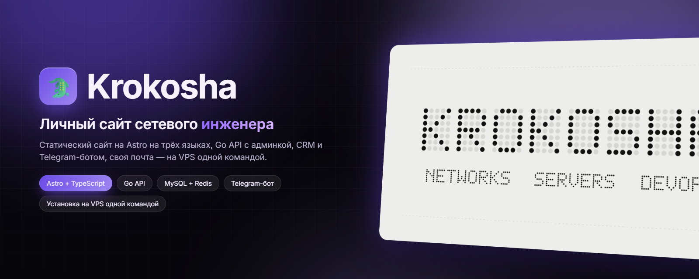
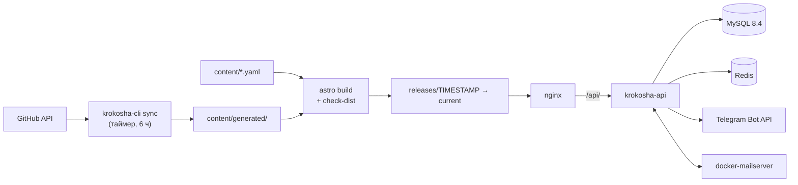

<div align="center">



# krokosha-site

**Исходники [krokosha.com](https://krokosha.com) — личного сайта Krokosha, инженера по сетям и инфраструктуре. Статический сайт на Astro, собственный Go API с админкой, CRM для заявок и Telegram-ботом, и установщик, который ставит всё на VPS одной командой.**

[](https://github.com/DenisHumen/krokosha-site/actions/workflows/ci.yml)
[](web/package.json)
[](api/go.mod)
[](deploy/compose/compose.yaml)
[](deploy/README.md)
[-6b4de6?style=for-the-badge)](LICENSE)
[](https://github.com/DenisHumen/krokosha-site/commits/main)

[English](README.md) · **Русский**

[Возможности](#-возможности) · [Быстрый старт](#-быстрый-старт) · [Развёртывание](#-использование) · [Архитектура](#-стек-и-архитектура) · [Планы](#-планы)

</div>

---

В этом репозитории — всё, на чём работает [krokosha.com](https://krokosha.com), сайт Krokosha (сети, серверы, DevOps, инструменты). Страницы собираются Astro в статический HTML из редактируемых YAML-файлов и данных GitHub, которые подтягивает синхронизация на Go. Один Go-сервис отвечает за собственную аналитику, админку, CRM для заявок с формы, Telegram-бота, личный кабинет клиента и интерактивную карту интернета. Один скрипт ставит весь стек на чистый сервер с Ubuntu, а CI проверяет эту установку от начала до конца.

> **Статус:** по [docs/roadmap.md](docs/roadmap.md) бэкенд готов полностью (шаги 1–8), дизайн v1 интегрирован в сайт, админка и личный кабинет — в дизайне v3. Большая часть проектной документации — на русском.

<div align="center">
  
</div>

## ✨ Возможности

**Сайт**

| | |
|---|---|
| 🌐 **Три языка и полноценное SEO** | Английский (`/`), украинский (`/uk/`), русский (`/ru/`): hreflang, canonical, Open Graph, JSON-LD, `sitemap.xml` и `robots.txt`. В CI действуют пороги Lighthouse 0,95. |
| 🔒 **Строгий CSP, JavaScript не обязателен** | Astro считает хэши всех скриптов и стилей и кладёт CSP в `<meta>`; страница читается и работает без JavaScript, включая форму заявки. |
| 🗂 **Контент как данные** | Тексты лежат в `content/*.yaml` и проверяются строгой схемой: опечатка останавливает сборку, а не ломает сайт. Стаж считается при каждой сборке. |
| 🐙 **Проекты с GitHub** | `krokosha-cli sync` раскладывает публичные репозитории по уровням, кэширует ответы с ETag и работает без токена и при недоступном GitHub. |
| 🗺 **Карта интернета** (`/map`) | Автономные системы и связи между ними по открытым данным, в трёх видах (карта, ядро, глобус); рисует вероятный путь между двумя адресами и умеет измерить путь с сервера сайта. |
| 🥚 **Пасхалки и ачивки** | Спрятанные пасхалки с редкостью ачивок как в Steam и звуками, плюс игра на странице 404. |
| 👤 **Личный кабинет** (`/account`) | Вход без пароля — по одноразовому коду на почту или от Telegram-бота: заявки и переписка, скидки и уровни, ачивки, контакты и устройства. |

**Бэкенд (`krokosha-api`)**

| | |
|---|---|
| 📊 **Приватная аналитика** | Собственный скрипт без cookie (< 3 КБ gzip). Посетитель — хэш с дневной солью, IP хранится только усечённым, DNT/GPC соблюдаются, боты отсеиваются. Дневные итоги и гео по локальной базе (DB-IP City Lite или GeoLite2). |
| 🧑‍💼 **Админка** | Секретный путь, пароли argon2id, 2FA по TOTP, защита от CSRF, список сеансов и журнал действий. Обзор с живой лентой (SSE), визиты, экспорт в CSV, трафик сервера по JSON-логу nginx, статус системы и кнопка «пересобрать сейчас». |
| 📨 **CRM для заявок** | Форма без JavaScript, антиспам по баллам и proof-of-work, совместимый с ALTCHA, транзакционный outbox с повторами, список и канбан-доска, шаблоны ответов на трёх языках, быстрые ответы с файлами, вложения по желанию и сроки хранения. |
| 🤖 **Telegram-бот** | Работает с Bot API без библиотек: доступ по приглашениям, карточки заявок с кнопками, переписка с клиентами через бота, `/leads` `/lead` `/search` `/stats` `/mute`, напоминания и утренний дайджест. Webhook или long polling. |
| ✉️ **Свой почтовый сервер** | docker-mailserver (Postfix, Dovecot, Rspamd) с DKIM, адреса для ответов подписаны HMAC, ответы клиентов читаются по IMAP IDLE и попадают в нужную заявку. |

**Эксплуатация**

| | |
|---|---|
| 🚀 **Установка одной командой** | `deploy/install.sh` настраивает nginx + Let's Encrypt, MySQL/Redis/почту в Docker, закреплённые версии Go и Node.js с проверкой SHA-256, UFW (WireGuard продолжает работать), fail2ban и таймеры systemd. Повторный запуск безопасен. |
| 🔁 **Релизы и откат** | Каждые 6 часов сайт собирается в новый каталог релиза, проверяется, после чего симлинк переключается атомарно; три последних релиза хранятся для `rollback.sh`. Домен меняется одной командой. |
| 💾 **Резервные копии** | Каждую ночь: дамп MySQL, настройки, сертификаты, письма и вложения (жёсткие ссылки между копиями), 7 дневных + 4 недельных, при желании `rsync` на другую машину; `restore.sh` поднимает потерянный сервер. |
| 🩺 **Наблюдение** | Проверка сертификатов, которые реально отдают nginx и почтовый сервер, оповещения владельца на почту и в Telegram, IndexNow для изменившихся страниц. |
| 🧪 **Проверенная установка** | Локальный «VPS в контейнере» запускает настоящий установщик; CI ставит, обновляет, откатывает, восстанавливает и удаляет сайт на чистой VM с Ubuntu 24.04. |

## 🚀 Быстрый старт

**Что понадобится:** Node.js ≥ 22.12 (в CI и на сервере — версия из [`web/.nvmrc`](web/.nvmrc)), Go (версия из [`api/go.mod`](api/go.mod)) и Docker — для интеграционных тестов, локальной админки и стенда.

### Сайт (`web/`)

```bash
git clone https://github.com/DenisHumen/krokosha-site.git
cd krokosha-site/web
npm ci
npm run dev       # http://localhost:4321
npm run verify    # всё, что проверяет CI: формат, линт, типы, тесты, mock/, сборка, проверка dist/
```

Если `content/generated/github.json` нет (свежий клон), сборка берёт снимок репозиториев из `mock/en/projects.json`.

<details>
<summary><b>Все npm-скрипты</b></summary>

| Скрипт | Что делает |
|---|---|
| `npm run dev` | Dev-сервер Astro на `:4321` |
| `npm run build` · `npm run preview` | Сборка в `dist/` · просмотр собранного |
| `npm run check` · `npm run lint` | `astro check` (типы) · ESLint (TypeScript, Astro, доступность) |
| `npm run format` · `npm run format:check` | Prettier |
| `npm test` | Unit-тесты Vitest |
| `npm run test:e2e` | Playwright + axe по собранному сайту (сначала `npm run build`) |
| `npm run mock` · `npm run mock:check` | Пересобрать `../mock/` после правок `content/*.yaml` · проверить, что он актуален |
| `npm run verify` | Всё перечисленное, что запускает CI, плюс `scripts/check-dist.mjs` |

</details>

### API и CLI (`api/`)

```bash
cd api
go test ./...                                         # unit-тесты (интеграционные пропускаются)
docker compose -f compose.test.yaml up -d --wait      # одноразовые MySQL и Redis
KROKOSHA_TEST_MYSQL=127.0.0.1:33306 KROKOSHA_TEST_REDIS=127.0.0.1:36379 go test ./...
go run ./cmd/krokosha-cli sync -v                     # данные GitHub → ../content/generated/
go build -trimpath -o bin/ ./cmd/...                  # krokosha-api и krokosha-cli
dev/run-local.sh                                      # админка с демо-данными → http://localhost:8099/_dev/
```

`GITHUB_TOKEN` необязателен: fine-grained токен только на чтение поднимает лимит GitHub API с 60 до 5000 запросов в час.

### Локальный стенд

Контейнер Docker, который ведёт себя как VPS (Ubuntu 24.04 с systemd) и запускает настоящий установщик, включая MySQL и Redis:

```bash
deploy/docker/staging/staging.sh up       # установить текущую ветку → https://krokosha.localhost
deploy/docker/staging/staging.sh update   # подтянуть новые коммиты и применить
deploy/docker/staging/staging.sh test     # полный цикл, как в CI: установка, повтор, update, откат, удаление
deploy/docker/staging/staging.sh shell    # root-консоль внутри
deploy/docker/staging/staging.sh down     # убрать стенд
```

Сертификат самоподписанный. Админка стенда — `https://krokosha.localhost/_staging/` (логин `dev`; случайный пароль печатает `staging.sh up`). На Windows нужен Docker Desktop, запускать из Git Bash или WSL.

## ⚙️ Настройка

**Контент** лежит в [`content/`](content/README.md) и подхватывается следующей сборкой (каждые 6 часов или по кнопке «пересобрать» в админке):

| Файл | Что внутри |
|---|---|
| `content/site.yaml` | Адрес сайта, профиль, `career_start`, соцсети, направления услуг, тексты интерфейса, SEO, флаги (пасхалки, форма, вложения) |
| `content/skills.yaml` | Дерево навыков: категория → группа → навык (пункты с `confirmed: false` скрыты) |
| `content/projects.yaml` | Закреплённые и скрытые репозитории, ручные правки, приватные (NDA) проекты |
| `content/pages/*.md` | Длинные тексты по языкам (политика конфиденциальности) |
| `content/avatar.*` | Необязательный свой аватар; иначе берётся аватар с GitHub |

Адрес сайта берётся из `content/site.yaml`; при сборке его можно переопределить переменной `SITE_URL`.

**Настройки и секреты сервера** хранятся в `/etc/krokosha/env` (root, `600`); файл создаёт и поддерживает установщик. Все переменные описаны в [`deploy/env/.env.example`](deploy/env/.env.example).

<details>
<summary><b>Основные переменные сервера</b></summary>

| Переменная | По умолчанию | Назначение |
|---|---|---|
| `DOMAIN`, `SITE_URL`, `ADMIN_EMAIL` | из `install.sh` | Имя сайта, публичный адрес, адрес администратора |
| `ADMIN_PATH` | случайный | Секретный префикс админки |
| `KROKOSHA_DATA` | `/srv/krokosha` | Корень всего, что должно пережить переезд |
| `MYSQL_ADDR`, `MYSQL_DATABASE`, `MYSQL_USER`, `MYSQL_PASSWORD` | `127.0.0.1:3306`, `krokosha`, `krokosha`, генерируется | База данных |
| `REDIS_URL` | локальный, пароль генерируется | Необязателен: без него лимиты считаются в памяти |
| `APP_SECRET` | генерируется | Подписывает задачи proof-of-work, адреса для ответов и ссылки |
| `SMTP_*`, `MAIL_*`, `IMAP_*` | задаются вместе с почтой | Исходящая почта, служебный ящик `leads@` |
| `TELEGRAM_BOT_TOKEN`, `TELEGRAM_MODE` | пусто, `webhook` | Токен бота; `webhook` или `polling` |
| `LEADS_KEEP_MONTHS`, `LEADS_EXPIRED`, `LEADS_SPAM_DAYS` | `24`, `anonymize`, `30` | Сроки хранения заявок |
| `ANALYTICS_KEEP_MONTHS` | `12` | Сколько хранить сырую аналитику (дневные итоги остаются) |
| `GEOIP_DB` | задаёт установщик (DB-IP City Lite) | Файл MaxMind DB для стран и городов; `off` — выключить |
| `INDEXNOW` | `yes` | Сообщать поисковикам об изменившихся страницах |
| `BACKUP_KEEP_DAILY`, `BACKUP_KEEP_WEEKLY`, `BACKUP_RSYNC_TO` | `7`, `4`, пусто | Ротация копий и копия на другую машину |
| `GITHUB_TOKEN` | пусто | Необязательный токен только на чтение для sync |

</details>

## 🧭 Использование

### Установка на сервер

Ubuntu 24.04 (или Debian 12), домен уже указывает на сервер:

```bash
git clone https://github.com/DenisHumen/krokosha-site.git
sudo ./krokosha-site/deploy/install.sh --domain example.com --email admin@example.com
```

Установщик попросит принять условия Let's Encrypt (или `--agree-tos`), затем логин и пароль первого администратора (без эха, дважды, не короче 12 символов). В конце он печатает секретный адрес админки — сохраните его. Повторный запуск приводит сервер к тому же состоянию; все параметры — `install.sh --help`.

| Что | Где |
|---|---|
| Код и бинарники | `/opt/krokosha/repo`, `/opt/krokosha/bin` |
| Закреплённые Go / Node.js | `/opt/krokosha/toolchain` (версии и SHA-256 — в [`deploy/toolchain.env`](deploy/toolchain.env)) |
| Релизы сайта | `/var/www/krokosha/releases/<дата-время>`, `current` → живой релиз |
| **Данные** | `/srv/krokosha`: `mysql/`, `redis/`, `mail/`, `attachments/`, `backups/`, `config/` |
| Настройки и секреты | `/etc/krokosha/env` → `/srv/krokosha/config` |
| API | `krokosha-api.service` на `127.0.0.1:8080`, за nginx по `/api/` |
| Логи | `journalctl -u krokosha-sync.service` (и другие юниты `krokosha-*`), `/var/log/krokosha/` (JSON access-логи, 30 дней) |

### Повседневное обслуживание

```bash
sudo /opt/krokosha/repo/deploy/update.sh              # подтянуть main и применить: код, конфиги, сборка, релиз
sudo systemctl start krokosha-sync.service            # пересобрать сейчас (само — каждые 6 часов)
sudo /opt/krokosha/repo/deploy/rollback.sh            # вернуть предыдущий релиз (--list — показать все)
sudo /opt/krokosha/repo/deploy/backup.sh              # резервная копия сейчас (сама — каждую ночь в 03:30)
sudo /opt/krokosha/repo/deploy/restore.sh --from DIR  # восстановить из копии
sudo /opt/krokosha/repo/deploy/uninstall.sh           # удалить сайт; данные в /srv/krokosha остаются (--purge удаляет и их)
sudo /opt/krokosha/repo/deploy/install.sh --from-env --domain НОВЫЙ-ДОМЕН   # переезд на новый домен
```

<details>
<summary><b>Параметры установщика</b></summary>

| Параметр | Описание |
|---|---|
| `--domain DOMAIN` · `--email EMAIL` | Имя сайта · адрес администратора (Let's Encrypt, оповещения) |
| `--old-domain NAME` | Прежнее имя, которое отвечает редиректом `301` (`none` — отпустить) |
| `--tls letsencrypt\|selfsigned\|none` · `--agree-tos` · `--staging` | Режим сертификата · принять условия LE · staging-CA LE |
| `--allow PORT/PROTO` · `--skip-firewall` · `--skip-dns-check` | Дополнительный открытый порт (можно несколько) · не трогать UFW · не проверять DNS |
| `--data-dir DIR` | Корень данных (по умолчанию `/srv/krokosha`) |
| `--admin-path PATH` · `--admin-login LOGIN` · `--admin-password-file FILE` | Путь админки и первый администратор |
| `--telegram-token-file FILE` · `--telegram-api URL` | Токен бота · другой сервер Bot API |
| `--maxmind-account ID` · `--maxmind-key-file FILE` · `--dbip-url URL` | GeoLite2 вместо DB-IP · другое зеркало DB-IP |
| `--no-mail` · `--mailbox ADDRESS` · `--mail-name NAME` · `--mailbox-password-file FILE` | Без почтового сервера · ящик владельца · имя отправителя |
| `--no-indexnow` · `--indexnow-api URL` | Выключить IndexNow · другой адрес |
| `--netmap-offline` | Строить `/map` только из уже скачанных файлов |
| `--repo URL` · `--branch NAME` · `--from-env` | Репозиторий и ветка · взять сохранённые настройки (так делает `update.sh`) |

</details>

### `krokosha-cli`

| Команда | Назначение |
|---|---|
| `krokosha-cli sync` | Забрать данные GitHub в `content/generated/` |
| `krokosha-cli admin list\|create\|passwd\|disable\|enable\|totp-reset` | Управление учётными записями админки |
| `krokosha-cli bot …` | Проверка токена, приглашения и доступ к Telegram-боту |
| `krokosha-cli alert --subject "…"` | Поставить оповещение владельцу в очередь (почта + Telegram) |
| `krokosha-cli indexnow --release DIR` | Сообщить об изменившихся страницах релиза |
| `krokosha-cli netmap sync\|fetch\|build\|route\|trace\|serve` | Построение карты интернета и запросы к ней |

Подробные справочники: [api/README.md](api/README.md) · [deploy/README.md](deploy/README.md) · [web/README.md](web/README.md).

## 🧱 Стек и архитектура

| Слой | Выбор |
|---|---|
| Фронтенд | Astro 7 + TypeScript → статический HTML; небольшие собственные скрипты; Canvas 2D (руки на главном экране, пасхалки) и WebGL (`/map`); шрифты Fontsource без внешних запросов |
| API | Go: `krokosha-api` — один статический бинарник под systemd на `127.0.0.1:8080` |
| Хранилище | MySQL 8.4 (источник истины) + Redis (лимиты, живые данные, буферы; необязателен), оба в Docker, все данные в одной директории |
| Периметр | nginx + Let's Encrypt (Certbot), fail2ban, UFW |
| Почта | docker-mailserver 16 (Postfix, Dovecot, Rspamd, без ClamAV) на том же сервере |
| CI | GitHub Actions: `web` (линт, типы, тесты, сборка), `api` (golangci-lint, govulncheck, тесты с race detector), `deploy` (shellcheck + настоящая установка), `e2e` (Playwright, axe, Lighthouse) |

Всё, что видно на сайте (проекты, аватар, стаж), впекается в статический HTML при сборке; таймер каждые 6 часов заново синхронизирует данные GitHub и пересобирает сайт.



## 📁 Структура проекта

```text
krokosha-site/
├── design/     Зона дизайна: токены, компоненты, ассеты, превью страниц
├── web/        Astro-приложение: оборачивает компоненты design/ и подставляет данные
├── content/    Редактируемый контент (YAML): тексты живут здесь, а не в разметке
├── mock/       Образцы данных в формате контракта (для дизайна и тестов)
├── api/        Go API (krokosha-api) и CLI (krokosha-cli), миграции, инструменты разработки
├── deploy/     install / update / backup / restore / rollback, nginx, systemd, почта, стенд, проверки CI
└── docs/       Бриф, контракт данных, архитектура, дорожная карта, карта интернета, Telegram, дизайн
```

В каждой директории верхнего уровня есть свой `README.md` с её структурой и правилами. Ключевые документы:

- [docs/brief/MASTER_PROMPT.md](docs/brief/MASTER_PROMPT.md): полный бриф проекта
- [docs/contract.md](docs/contract.md): контракт данных между дизайном и бэкендом
- [docs/architecture.md](docs/architecture.md): архитектурные решения
- [docs/roadmap.md](docs/roadmap.md): что сделано и что дальше
- [docs/netmap.md](docs/netmap.md): карта интернета
- [docs/telegram.md](docs/telegram.md): как устроен Telegram-бот
- [docs/design/CLAUDE_DESIGN_PROMPT.md](docs/design/CLAUDE_DESIGN_PROMPT.md): задание для агента дизайна

## 🗺 Планы

Открытые пункты из [docs/roadmap.md](docs/roadmap.md) и [docs/netmap.md](docs/netmap.md):

- [x] Статический сайт на трёх языках, синхронизация с GitHub, установщик с резервными копиями и откатом
- [x] Бэкенд: аналитика, админка, заявки, Telegram-бот, почта, эксплуатация (шаги 1–8)
- [x] Дизайн v1 на сайте; личный кабинет, скидки и ачивки
- [x] Карта интернета с замерами с сервера сайта
- [ ] Выкладка на VPS с проверкой доставляемости почты (mail-tester ≥ 9/10)
- [ ] `/map`: замеры из сети отправителя через RIPE Atlas
- [ ] Мини-игра на `/play` (сейчас заглушка)
- [ ] Удалить временные референсы дизайна из `docs/brief/refs/`

## 🤝 Участие в разработке

Ветка `main` защищена: каждое изменение идёт через pull request, и CI должен пройти. Изменения дизайна затрагивают только `design/` (см. [design/README.md](design/README.md)); если меняются разметка или данные, [docs/contract.md](docs/contract.md) обновляется в том же PR.

## 📄 Лицензия

Код — [MIT](LICENSE). Лицензия распространяется только на исходный код: контент сайта (тексты в `content/`, фотографии, имя Krokosha, маскот и изображения персонажей в `design/assets/`) — © Krokosha, все права защищены, если в самом файле не указано иное. Встроенные шрифты распространяются по SIL Open Font License; данные GeoIP — от DB-IP (CC BY 4.0) или MaxMind GeoLite2.
